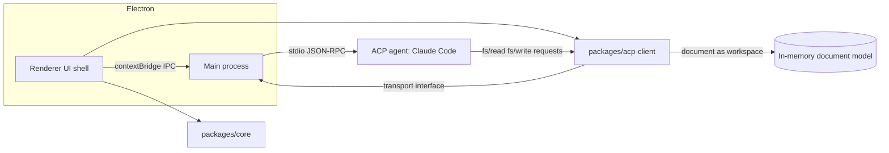

# Design Document: Mermaid Document Renderer

**Status:** Draft v1
**Author:** QWTS
**Date:** 2026-08-19
**Decisions locked:** Electron-first · Markdown-with-mermaid-blocks document model · Standalone from Cartograph with a clean projection seam

---

## 1. Purpose

A production-grade renderer for *documents* containing Mermaid diagrams — markdown files with fenced ```mermaid blocks — with first-class agentic capabilities. Agents (Claude Code, Gemini CLI, or any ACP-speaking agent) connect over the Agent Client Protocol to generate, explain, refactor, and lint diagrams, and eventually to produce repo-aware architecture diagrams.

The UI shell is generated with Lovable, then hardened to production by Claude Code against the contracts defined in this document.

## 2. Goals

- Render markdown documents with embedded Mermaid blocks: live preview, error diagnostics with line mapping, export.
- Act as an **ACP client** so local agents can operate on the open document with streaming edits, diff preview, and undo integration.
- WCAG 2.1 AA accessibility and full i18n (externalized strings, RTL) from the first commit.
- Deterministic UI/UX testability, including agentic flows, via explicit test seams.
- Architecture that ports to hosted-web later without rework (shared core, thin shells).

## 3. Non-Goals (v1)

- Hosted web deployment and the localhost bridge daemon (designed here, built later).
- Multi-agent orchestration; MVP targets one agent (Claude Code via its ACP adapter).
- Real-time multi-user collaboration.
- General markdown WYSIWYG editing; the editor is source-first.
- Cartograph integration (seam only, no coupling).

## 4. Architecture Overview

Monorepo. All load-bearing logic in framework-agnostic TypeScript packages; shells are dumb hosts.

```
repo/
  packages/
    core/          # document model, mermaid pipeline, export, theming
    acp-client/    # ACP client (JSON-RPC), transport-agnostic
    transport/     # stdio-over-IPC (Electron), ws-bridge (future)
    test-agents/   # ACP transcript player + recorded fixtures
    design-tokens/ # tokens as the single source of truth, fed to Lovable
  apps/
    electron/      # main + preload + renderer shell (Lovable-derived)
    web/           # future hosted shell
    bridge/        # future localhost daemon
```



**Key principle:** Lovable only ever generates the shell layer in `apps/electron/renderer`. The ACP client, document model, and render pipeline are injected dependencies, never generated code.

### Trade-off: Electron vs Tauri

Tauri is lighter and QWTS has Tauri 2 experience from Cartograph. Electron chosen anyway: Node in the main process makes spawning/managing the agent subprocess and stdio plumbing trivial, and Lovable output (React/Vite) drops in with zero friction. Revisit if bundle size or memory becomes a complaint; the shared-core split keeps the switch cheap.

## 5. Document Model

- **Unit of work:** a markdown document; each fenced ```mermaid block is a diagram node with stable identity (content hash + ordinal fallback) so agents and the preview can address blocks individually.
- **Raw .mmd support:** treated as a single-block document (degenerate case, free).
- **Frontmatter:** per-document config (theme, mermaid version, direction/RTL hints).
- **Persistence:** files on disk in Electron; the model itself is storage-agnostic (in-memory workspace for future hosted mode).
- **Edit log:** all mutations flow through a command layer (user edits and agent edits alike) → single undo stack, diff preview for agent changes.

## 6. Rendering Pipeline

- Mermaid renders in a **sandboxed iframe** (`sandbox` attr, no `allow-same-origin`, `securityLevel: 'strict'`). This is both the security boundary (Mermaid has an XSS CVE history; diagrams may come from untrusted files or, later, share links) and the isolation boundary (Mermaid requires a DOM; no clean worker offload exists).
- **Version pinning:** mermaid version resolved per document (frontmatter) with an app default. Majors break syntax; pinning is a feature, not a chore. Ship 2–3 bundled versions.
- Parse errors map back to source lines in the editor gutter; the renderer never white-screens on a bad block — failed blocks render an inline diagnostic card, healthy blocks still render.
- Export: SVG (native), PNG (offscreen rasterize), clipboard; PDF in v1.

## 7. ACP Integration

The renderer implements the **client** (editor) role of the Agent Client Protocol. Agents are external processes speaking JSON-RPC over stdio.

### 7.1 Transport matrix

| Deployment | Transport | Status |
|---|---|---|
| Electron | Main spawns agent subprocess; stdio ↔ contextBridge IPC ↔ renderer | **MVP** |
| Hosted web | Browser ↔ WSS to 127.0.0.1 bridge daemon ↔ stdio ↔ agent | Designed, deferred |
| Local web | Same-origin WS to bridge | Deferred |

`packages/acp-client` depends only on a `Transport` interface (`send`, `onMessage`, lifecycle). Electron ships the IPC transport; the bridge transport slots in later without touching client logic.

### 7.2 Client responsibilities (where the effort actually is)

- `initialize` / capability negotiation; `session/new`, `session/prompt`, cancellation.
- Render streaming session updates: agent plan, tool-call progress, text chunks.
- **Permission UI:** agents request permission for tool calls; the renderer needs a non-blocking approval surface with per-session "always allow" scoping. This is the largest UI lift in the agentic feature set.
- **Filesystem mediation — the elegant part:** in ACP the *client* serves `fs/read`/`fs/write`. The renderer presents the in-memory document model as the workspace. Consequences:
  - Agent edits arrive as writes through the command layer → free undo, diff preview, and streaming preview updates.
  - The agent never needs real disk access for document-scoped tasks, which is exactly what makes the future hosted mode viable.
  - Workspace scope is a policy decision: MVP exposes the open document (+ optionally its folder, permission-gated), nothing else.

### 7.3 Bridge daemon (deferred, designed now)

Loopback bind only; per-session pairing token (user runs `npx <bridge>`, token deep-linked into the app); strict `Origin` allowlist; answers Chrome Private Network Access preflights (`Access-Control-Allow-Private-Network: true`). Localhost is a secure-context exception so `ws://127.0.0.1` from an https page works in current Chrome/Firefox, but PNA enforcement is tightening — the preflight handling is not optional.

### 7.4 The seam (Cartograph and beyond)

Two integration points, kept distinct:

1. **Renderer as ACP client** (this doc): agents operate on documents.
2. **Renderer as tool provider** (future): expose `render`, `validate`, `export` as MCP tools so external systems — including Cartograph's projection layer — can drive the renderer. The document model's block-addressing scheme is the contract that makes this seam clean. No Cartograph types or dependencies enter this repo.

## 8. Feature Tiers

**MVP (Electron):**
- Split-pane source editor + live preview, per-block rendering, sync scroll
- Error diagnostics with line mapping; resilient per-block failure
- Pan/zoom on diagrams; export SVG/PNG/clipboard
- Dark/light themes; mermaid version pinning
- Open/save/watch local files; recent files
- ACP: connect to Claude Code, prompt on selection/block/document, streaming edits with diff preview, permission UI

**V1:**
- Templates/diagram catalog; custom theme variables; PDF export
- Multi-document tabs; frontmatter config UI
- Agentic: explain-this-diagram, refactor/normalize, lint agent (style + semantic checks)

**V2 / differentiators:**
- Repo-aware generation: agent reads a codebase, emits architecture/sequence/ER diagrams into a document (permission-gated folder workspace)
- Hosted web + bridge; share links (sandboxed render path already assumes untrusted input)
- MCP tool surface (seam activation)

## 9. Design System, Accessibility, i18n

Tokens are authored in the **DESIGN.md format** (google-labs-code/design.md): YAML tokens + prose rationale in one agent-readable file. `packages/design-tokens` holds `DESIGN.md` as the single source of truth plus generated exports — `export --format css-tailwind` produces the Tailwind v4 theme the Lovable shell consumes. CI gates: `design.md lint` (broken refs, WCAG contrast on component pairs) and `design.md diff` as a token-regression check on any PR touching it. The format is alpha — pin the CLI version. Note its component-token vocabulary is narrow (no motion/elevation/focus tokens); those invariants live in the DESIGN.md prose, which agents follow but the linter can't verify — the axe/Playwright gates cover that gap. Lovable consumes tokens, never invents them.

**Accessibility (WCAG 2.1 AA):**
- Semantic landmarks and roles across the shell; full keyboard operability including pane focus traversal and diagram pan/zoom via keyboard
- Diagrams get accessible names/descriptions (Mermaid `accTitle`/`accDescr` surfaced and agent-fillable — a lint-agent rule)
- Contrast enforced at the token level; visible focus states; reduced-motion respect
- axe-core in CI as a merge gate, manual screen-reader pass per milestone

**i18n:**
- Zero hardcoded strings from the first Lovable generation; i18next with ICU message format
- RTL layout support (logical CSS properties only — enforced by lint); locale-aware dates/numbers
- Pseudo-localization build target to catch truncation/concatenation in CI

## 10. Test Seams & Testing Strategy

The seams are contracts, specified before Lovable generates anything:

1. **`data-testid` convention:** `region.component.element` (e.g., `editor.gutter.error-badge`), documented in a registry file that tests import — no string drift.
2. **DI'd ACP client + transcript player:** `packages/test-agents` replays recorded JSON-RPC sessions as a fake agent. Deterministic Playwright tests of agentic flows — streaming edits, permission prompts, cancellations, malformed-agent-behavior — with no live model. This is the highest-value seam in the project.
3. **Render pipeline behind an interface:** preview tests can swap in a synchronous fake renderer; visual regression tests use the real one with pinned mermaid versions.
4. Storybook per shell component (a11y addon on); MSW for any network; Lighthouse + axe budgets as merge gates.

| Layer | Tooling |
|---|---|
| Unit (core, acp-client) | Vitest |
| Component | Storybook + testing-library + axe |
| E2E incl. agentic flows | Playwright + transcript player |
| Visual regression | Playwright screenshots, pinned mermaid |
| A11y/perf gates | axe-core, Lighthouse CI |

## 11. Lovable → Claude Code Handoff Contract

**What Lovable produces (and what survives):** screens/layout, component shells, token application. **What Claude Code rewrites:** state management, async/data layer, IPC wiring, anything touching `packages/*`.

The Lovable prompt is *derived from this doc* and scoped to the shell: screen inventory, design tokens, the testid registry, ARIA/i18n rules ("no literal strings; every interactive element keyboard-reachable"), and an explicit constraint: *UI state only — no data fetching, no business logic, props-driven components*.

Claude Code executes against a six-file package (pattern proven on Cartograph): CLAUDE.md, this SPEC, ADRs, MILESTONES, US backlog, tracker CSV. Acceptance criteria per screen reference the testid registry and the a11y/i18n gates, so "production level" is measurable, not vibes.

## 12. Security Model

- All diagram rendering sandboxed (untrusted-input assumption everywhere, day one)
- Agent subprocess: explicit binary allowlist, no shell interpolation, env scrubbed
- ACP permission gating on every tool call touching outside the open document
- Electron hardening: `contextIsolation` on, `nodeIntegration` off, strict preload API surface, CSP on renderer
- Future bridge: loopback-only, token pairing, Origin allowlist, PNA preflight (§7.3)

## 13. Risks

| Risk | Mitigation |
|---|---|
| Mermaid XSS / CVE history | Sandboxed iframe, `securityLevel: strict`, no same-origin |
| Mermaid version breakage | Per-document pinning, bundled versions, visual regression on pinned set |
| Lovable output quality | Shell-only scope, contract-driven prompt, planned Claude Code rewrite of non-UI layers |
| ACP client underestimation | Permission UI and streaming-update rendering sized as their own milestone; transcript player built first so the UI is testable while the real integration lands |
| Bridge scope creep | Deferred entirely; interface designed, zero code in MVP |
| Repo-aware generation hallucination | Same risk class as Cartograph US-2002; keep behind the seam, treat as V2 research |

## 14. Milestones

- **M0** — Monorepo, tokens, testid registry, transcript-player harness, CI gates (axe/Lighthouse/pseudo-loc/design.md lint+diff). *Seams before shell.*
- **M1** — Lovable shell generation against the contract; Claude Code hardening pass; static rendering pipeline (no agents).
- **M2** — Editor/preview complete: diagnostics, export, theming, version pinning.
- **M3** — ACP MVP: Electron transport, Claude Code agent, permission UI, streaming edits + diff, fs mediation over the document model.
- **M4** — Agentic v1 features (explain/refactor/lint) + polish; a11y manual pass; ship.

## 15. Open Questions

1. Editor component: CodeMirror 6 (recommended — size, extensibility) vs Monaco (familiarity)?
2. How many mermaid versions to bundle, and what's the deprecation policy?
3. Permission model granularity: per-tool-call vs per-capability-per-session — needs a UX spike in M3.
4. Does the lint agent ship as a bundled ACP agent (we author it) or as prompts against Claude Code? Bundling one trivial agent would also dogfood the client against a second implementation.

## Revisit as it grows

Electron→Tauri if footprint matters; single-agent→multi-session once permission UX is proven; document-scoped workspace→folder-scoped when repo-aware generation lands; and the seam (§7.4) is the point where this either stays a product or becomes Cartograph's front end — that decision is deliberately deferred, not accidentally.
